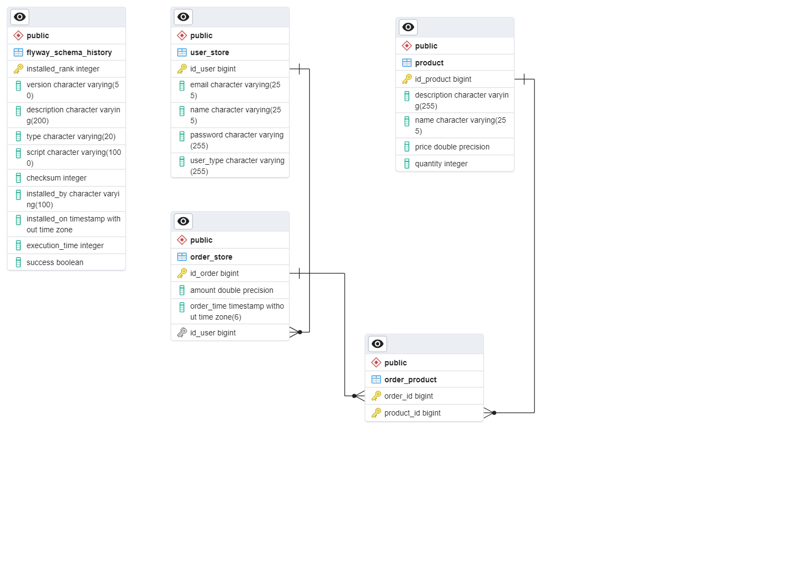

    Store Management Tool

        Api that acts as a store management tool.

    Stack of technologies:
        - Java 17 
        - Spring Boot 3.2.0 version
        - JPA(Java Persistent Api) for database model
        - PostreSql is open-source relational database management system
        - Flyway is an open-source database migration tool,
            used for process of versioning and managing database schema changes
        - Swagger is an open-source standard for describing and documenting RESTful APIs

    Describe and document RESTful APIs:

http://localhost:8080/swagger-ui/index.html

    Database model and relationship between tables

    
 

        